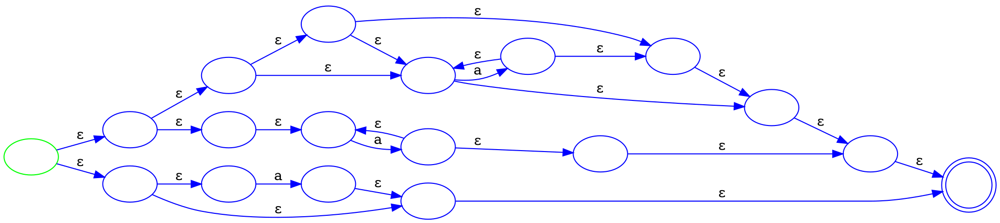

## RE: 
### Preprocess : 
### Postfix : 

```dot

digraph NFA {
rankdir=LR;
graph [bgcolor = transparent];
node [color = blue, fontcolor = white]
edge [color = blue];
16 [color = green];
17 [shape = doublecircle];
0 -> 1 [ label = "a" ];
6 -> 7 [ label = "a" ];
12 -> 13 [ label = "a" ];

0 -> 5 [ label = "ε" ];
1 -> 0 [ label = "ε" ];
1 -> 3 [ label = "ε" ];
2 -> 0 [ label = "ε" ];
2 -> 3 [ label = "ε" ];
3 -> 5 [ label = "ε" ];
4 -> 0 [ label = "ε" ];
4 -> 2 [ label = "ε" ];
5 -> 11 [ label = "ε" ];
7 -> 6 [ label = "ε" ];
7 -> 9 [ label = "ε" ];
8 -> 6 [ label = "ε" ];
9 -> 11 [ label = "ε" ];
10 -> 4 [ label = "ε" ];
10 -> 8 [ label = "ε" ];
11 -> 17 [ label = "ε" ];
13 -> 15 [ label = "ε" ];
14 -> 12 [ label = "ε" ];
14 -> 15 [ label = "ε" ];
15 -> 17 [ label = "ε" ];
16 -> 10 [ label = "ε" ];
16 -> 14 [ label = "ε" ];
}
```
