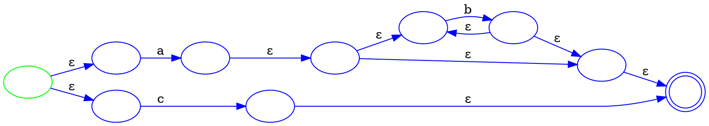

## RE: ab*|c
### Preprocess : a^b*|c
### Postfix : ab*^c|

```dot

digraph NFA {
rankdir=LR;
graph [bgcolor = transparent];
node [color = blue, fontcolor = white]
edge [color = blue];
8 [color = green];
9 [shape = doublecircle];
0 -> 1 [ label = "a" ];
2 -> 3 [ label = "b" ];
6 -> 7 [ label = "c" ];

1 -> 4 [ label = "ε" ];
3 -> 2 [ label = "ε" ];
3 -> 5 [ label = "ε" ];
4 -> 2 [ label = "ε" ];
4 -> 5 [ label = "ε" ];
5 -> 9 [ label = "ε" ];
7 -> 9 [ label = "ε" ];
8 -> 0 [ label = "ε" ];
8 -> 6 [ label = "ε" ];
}
```
