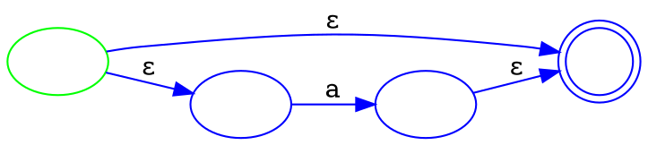
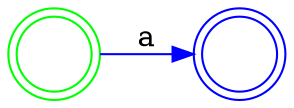

## RE: a?
### Preprocess : a?
### Postfix : a?

```dot

digraph NFA {
rankdir=LR;
graph [bgcolor = transparent];
node [color = blue, fontcolor = white]
edge [color = blue];
2 [color = green];
3 [shape = doublecircle];
0 -> 1 [ label = "a" ];

1 -> 3 [ label = "ε" ];
2 -> 0 [ label = "ε" ];
2 -> 3 [ label = "ε" ];
}
```

```dot
digraph DFA {
rankdir=LR;
rankdir=LR;
graph [bgcolor = transparent];
node [color = blue, fontcolor = white]
edge [color = blue];
0 [color = green];
0 [shape=doublecircle];
1 [shape=doublecircle];
0 -> 1 [ label = "a" ];

}
```
